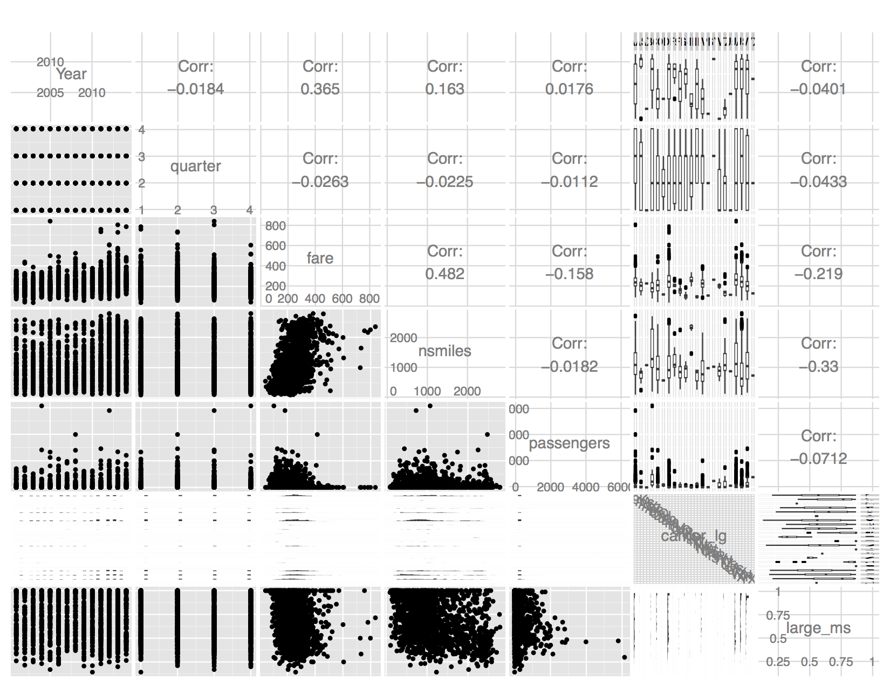

Airfare Exploration by Amir Ebrahimi
========================================================

```{r echo=FALSE, message=FALSE, warning=FALSE, packages}
# Load all of the packages that you end up using
# in your analysis in this code chunk.

# Notice that the parameter "echo" was set to FALSE for this code chunk.
# This prevents the code from displaying in the knitted HTML output.
# You should set echo=FALSE for all code chunks in your file.

library(data.table)
library(ggplot2)
library(memisc)
library(GGally)
library(dplyr)
library(tidyr)
library(zoo)
library(grid)
library(gridExtra)

af.read <- function(year, qtr) {
  tbl1a <- sprintf('1a-%d_%d.csv', year, qtr)

  if (file.exists(tbl1a)) {    
#     print(sprintf("%s %s", year, qtr))
    # airfares
    af <- read.csv(tbl1a, header = T, check.names = F)
#     af <- read.csv('1a-2014_4.csv', header = T, check.names = F)
    af_col_fixups = c("Quarter" = "quarter", "origin_cty" = "citymarketid_1", 
                   "dest_cty" = "citymarketid_2", "origin_apt" = "airport_1", 
                   "dest_apt" = "airport_2", "distance" = "nsmiles",
                   "origin" = "airport_1", "destination" = "airport_2", 
                   "Mktsh_Lg" = "large_ms", "Mktsh_low" = "lf_ms")
    # find any of the old column names that exist
    af_col_fixups <- af_col_fixups[lapply(names(af_col_fixups), 
                         function(x) ifelse(x %in% names(af), T, F)) == T]
    setnames(af, old = names(af_col_fixups), new = af_col_fixups)

    # before 2007 Q2 the year/qtr is a single field
    if ("Date" %in% colnames(af)) {
      af$Year <- as.numeric(substring(af$Date, 1, 4))
      af$quarter <- as.numeric(substring(af$Date, 5))
    }

    # before 2001 Q3 the year/qtr is in the quarter field
    if (!("Year" %in% colnames(af))) {
      af$Year <- as.numeric(substring(af$quarter, 1, 4))
      af$quarter <- as.numeric(substring(af$quarter, 5))
    }

    # standardize airport order, so that the data is consistent
    af <- af %>%
          mutate(apt1 = airport_1, apt2 = airport_2) %>%  
          mutate(airport_1 = as.factor(
              pmin(as.character(apt1), as.character(apt2))), 
            airport_2 = as.factor(
              pmax(as.character(apt1), as.character(apt2)))) %>%
          select(-starts_with("apt"))

    # prior to 2014 Q2, percentages were in whole numbers instead of [0-1]
    if (length(af_col_fixups) > 0) {
      af$large_ms <- af$large_ms / 100
      af$lf_ms <- af$lf_ms / 100
    }

    # 2011 has some erroneous citymarketids
    if ("citymarketid_1" %in% colnames(af)) {
      af$citymarketid_1 <- as.integer(af$citymarketid_1)
      af$citymarketid_2 <- as.integer(af$citymarketid_2)
    }

    # recode values to be missing where erroneous data is given
    af$carrier_lg[af$carrier_lg == ''] <- NA
    af$carrier_low[af$carrier_low == ''] <- NA
    af$large_ms[af$large_ms == 0 & is.na(af$carrier_lg)] <- NA
    af$lf_ms[af$lf_ms == 0 & is.na(af$carrier_low)] <- NA
    af$fare_lg[is.na(af$large_ms)] <- NA
    af$fare_low[is.na(af$lf_ms)] <- NA
    af$fare_low[af$fare_low == 1] <- NA

    # impute values where data is missing
    ?transform

    # remove unneeded columns
    af <- af %>%
      select(-one_of(c("tbl", "carrier", "carshare", "carfare", "Date")), 
             -starts_with("citymarketid"), -starts_with("airportid"),
             -starts_with("City"))

    af
  }
}
```

```{r echo=FALSE, Load_the_Data}
# Load the Data

# Only years 2004-2014 have tables 1a and 7
# Unfortunately 2007 Q3 is missing table 7, so that becomes a logical cut-off
# Table 1a exists for 2000 Q4 - 2014, but 2000 is an incomplete year
# years <- c(2014)
# qtrs <- c(4)
years <- c(2014:2001)
qtrs <- c(4:1)
# create a dataframe of descending sequential years by quarter
yq <- data.frame(year = rep(years, 1, each = length(qtrs)), 
                 qtr = rep(qtrs, length(years)))

# read each year / quarter into a separate dataframe
af.yearqtr <- mapply(af.read, yq$year, yq$qtr, SIMPLIFY = F, USE.NAMES = F)

# filter out the missing year(s) / quarter(s)
af.yearqtr <- af.yearqtr[lapply(af.yearqtr, is.null) == F]

# collect the factored variable column names because these will be lost after 
# combining rows across all of the dataframes; we will use these to re-create 
# the factored variables
column_classes <- sapply(data.frame(af.yearqtr[1]), class)
factored_variables <- names(column_classes[column_classes == 'factor'])

af <- suppressWarnings(bind_rows(af.yearqtr))

# re-create the factored variables
af[factored_variables] <- lapply(af[factored_variables], as.factor)

# get rid of duplicate records, which are caused by multiple low-fare carriers
# being included in the dataset. Individually these low-fare carriers don't have
# above 10% market share, but combined they show significant share. For the 
# purposes of this analysis I'm only including the largest share carriers
af <- af %>%
  group_by(Year, quarter, airport_1, airport_2) %>%
  arrange(desc(lf_ms)) %>%  
  # slice will keep all NAs / top_n will get rid of them because lf_ms, which
  # would be the weight would be NA for some
  slice(1) %>%
  ungroup()

af.all <- af
af <- na.omit(af)
af.na <- setdiff(af.all, af)

af$haul <- cut(af$nsmiles, breaks = c(0, 500, max(af$nsmiles)), 
               labels = c("short", "medium"))

sprintf("Omitting %d NA records (%0.2f%% of all records)", 
        nrow(af.all) - nrow(af), (1 - nrow(af) / nrow(af.all)) * 100)
summary(af.na)
```

# Univariate Plots Section
```{r echo=FALSE, Dataframe}
names(af)
str(af)
lapply(af[factored_variables], levels)
summary(af)
```

Across all of the airport pair markets:

* the average miles traveled is 1095
* the average passengers per day is 187
* the median passengers per day is 27
* the average of average quarterly fares is $242 and the max is $2567
* Delta is the most common carrier for the largest and lowest fares

What is the shortest airport pair distance?

```{r echo=FALSE}
af %>%
  filter(nsmiles == min(nsmiles)) %>%
  group_by(airport_1, airport_2) %>%
  slice(1) %>%
  ungroup() %>%
  select(airport_1, airport_2, nsmiles)
```

I'm curious which airport pairs had the most passengers traveling (on average) 
across all quarters:

```{r echo=FALSE}
af %>%
  group_by(airport_1, airport_2) %>%
  summarise(mean_passengers = mean(passengers)) %>%
  ungroup() %>%  
  arrange(desc(mean_passengers))
```

Now, I'm wanting to see what the most traveled airport pairs were for any given 
quarter:

```{r echo=FALSE}
af %>%
  group_by(airport_1, airport_2) %>%
  summarise(max_passengers = max(passengers)) %>%  
  ungroup() %>%  
  arrange(desc(max_passengers))

af %>%
  filter(airport_1 == 'JFK' & airport_2 == 'LAX') %>%
  arrange(desc(passengers)) %>%
  slice(1)
```

I'm wondering now how many unique airports there are in the dataset:

```{r echo=FALSE}
all_airports <- af  %>% 
  mutate(ap = as.character(airport_1)) %>%
  select(ap) %>%  
  group_by(ap) %>%
  slice(1) %>%  
  ungroup() %>%
  union(
    af %>%
      mutate(ap = as.character(airport_2)) %>%
      select(ap) %>%  
      group_by(ap) %>%
      slice(1) %>%
      ungroup()
      )
all_airports
```

```{r echo=FALSE}
airports <- af  %>% 
  mutate(ap = as.character(airport_1)) %>%
  union(
    af %>%
      mutate(ap = as.character(airport_2))
      ) %>%
  select(ap, passengers, fare) %>%  
  group_by(ap) %>%
  summarise(sum_passengers = sum(passengers),
            avg_passengers = mean(passengers),
            avg_fare = mean(fare)) %>%  
  arrange(desc(sum_passengers))

top_ten_airports = airports$ap[1:10]
top_five_airports = airports$ap[1:5]

airports %>%
  arrange(desc(sum_passengers))

airports %>%
  arrange(desc(avg_passengers))
```

I wonder what the most expensive airports to travel from are:

```{r echo=FALSE}
airports %>%
  arrange(desc(avg_fare))
```

Moving on to other variables:

```{r echo=FALSE, Univariate_Plots}
ggplot(af, aes(x = fare)) + geom_histogram(binwidth = 1)
quantile(af$fare, .99)
```

The plot looks to have a good normal curve, but with a long tail. The 99th 
quantile of the dataset is just under 500, so it makes sense to set a limit
on the x-axis to better view the histogram of fares

```{r echo=FALSE}
ggplot(af, aes(x = fare)) + geom_histogram(binwidth = 1) +
  xlim(c(min(af$fare), 500))
```

I'm curious what the outliers look like:

```{r echo=FALSE}
subset(af, fare > quantile(af$fare, .99)) %>%
  arrange(desc(fare))
```

Looks like most large fares involve large distances and I'll want to look at the
relationship between fares and distance when I get to bivariate analysis. I also
notice that the average passengers per day is under 1 for those city pairs. 
Another interesting thing to look at is the market share for those city pairs.
The DAL<->XNA pair seemed odd because of the low mileage, so I looked on Kayak
to see what current prices were and they were all above $500.

I am curious about what the average fare is for airport pairs that have less 
than 1 person / day on average to see if it is high:

```{r echo=FALSE}
subset(af, passengers < 1) %>%
  summarise(avgfare = mean(fare))
```

Surprisingly, it isn't as high as I thought it would be, but does fall beyond
the third quartile.

```{r echo=FALSE}
ggplot(af, aes(x = nsmiles)) + geom_histogram(binwidth = 10)
```

Mileage between airport pairs looks somewhat multimodal with heteroskedasticity 
or possibly a skewed normal distribution.

```{r echo=FALSE}
ggplot(af, aes(x = passengers)) + geom_histogram()
```

Re-scaling x-axis (log10) to view the long tail better:

```{r echo=FALSE}
ggplot(af, aes(x = passengers)) + geom_histogram() +
  scale_x_log10()
```

```{r echo=FALSE}
ggplot(af, aes(x = fare_lg)) + geom_histogram(binwidth = 1) + 
  xlim(c(min(af$fare_lg), 500))
ggplot(af, aes(x = fare_low)) + geom_histogram(binwidth = 1) + 
  xlim(c(min(af$fare_low), 500))
```

Now, I'm curious about the difference between the average low and large fares:

```{r echo=FALSE}
af %>%
  summarise(fare_diff = mean(fare_lg) - mean(fare_low))

af %>%
  mutate(fare_diff_percentage = (fare_lg - fare_low) / fare) %>%
  summarise(mean(fare_diff_percentage))
```

So, it looks like fares have a variance of 7% of the average fare between
the average large and low fares.

```{r echo=FALSE}
ggplot(af, aes(x = large_ms)) + geom_histogram(binwidth = 0.016) +
  scale_x_continuous(breaks = seq(0, 1, 0.1))
```

Seems like there is a sizable count of carriers with the largest fare that have
100% market share. I'd like to compare that to the rest:

```{r echo=FALSE}
local({
  ms1 <- af %>%
    count(large_ms == 1)
  print(ms1)
  ms1[2,2] / ms1[1,2]
})
```


```{r echo=FALSE}
ggplot(af, aes(x = lf_ms)) + geom_histogram(binwidth = 0.016) +
  scale_x_continuous(breaks = seq(0, 1, 0.1))
```

This last one is interesting, since there is a spike at 10%, so I looked at the
data to verify that it was good, which it is. The reason for this spike in the
data is [explained][1] by the DOT:

*Note that the “lowest fare carrier” is the carrier with the lowest average fare 
that has at least a 10 percent share of the traffic in the market, except for 
markets where only a single carrier has a 10 percent or greater share.*

[1]: http://www.dot.gov/policy/aviation-policy/air-fare-information-consumers

```{r echo=FALSE}
ggplot(af, aes(x = lf_ms)) + geom_histogram(binwidth = 0.01) + xlim(c(0, 0.2))
subset(af, lf_ms < 0.1) %>%
  select(Year, quarter, nsmiles, airport_1, airport_2, 
         carrier_low, lf_ms, fare_low)
```

Finally, I'm curious about what percentage of carriers are both the largest and
lowest fare carrier:

```{r echo=FALSE}
af %>%
  filter(as.character(carrier_lg) == as.character(carrier_low)) %>%
  summarise(n() / nrow(af))
```

# Univariate Analysis

### What is the structure of your dataset?

There are 160,258 records in the dataset with 13 features (Year, quarter, 
nsmiles, airport_1, airport_2, passengers, fare, carrier_lg, large_ms, fare_lg,
carrier_low, lf_ms, and fare_low). The variables airport_1, airport_2, 
carrier_lg, and carrier_low are unordered factor variables.

Other observations:

* the average miles traveled is 1095
* the average passengers per day is 187
* the median passengers per day is 27
* the average of average quarterly fares is $242 and the max is $2567
* Delta is the most common carrier for the largest and lowest fares

### What is/are the main feature(s) of interest in your dataset?

The main features of interest to me in the dataset are fare, nsmiles, and 
passengers. I'd like to figure out what variables influence the fare. My
guess is that distance between airports is a factor and that the activity
between airports may have some weight.

### What other features in the dataset do you think will help support your investigation into your feature(s) of interest?

Market share may have an impact on the average fare. My guess would be that 
areas that have high market share have less competition and may have higher
fares.

### Did you create any new variables from existing variables in the dataset?

At the time of my univariate analysis I had not created any variables. However,
after performing bivariate analysis I thought it would be good to create an 
additional categorical variable, haul, for segmenting short and medium trips. A
medium trip is anything over 500 miles.

### Of the features you investigated, were there any unusual distributions? Did you perform any operations on the data to tidy, adjust, or change the form of the data? If so, why did you do this?

Data cleaning was the bulk of the work during my investigation. I saw anomalies
in market share, large and low fares, and erroneous data that needed to be 
marked as NA. Some variable naming changed across the years of the dataset and
some fields were combined, so I had to fix those as well. I added the fixup code
to the data loading functions. These changes were necessary in order to have 
consistent data to analyze.

# Bivariate Plots Section
```{r echo=FALSE, Bivariate_Plots}
cor(af[,sapply(af, is.numeric)])
cor.test(af$nsmiles, af$fare)
cor.test(af$Year, af$fare)
```

As predicted, there is a strong positive correlation between mileage and fare, 
but passengers has a negligible relationship to price. Year has a moderate
positive correlation with fare.

```{r echo=FALSE}
# af_subset = af[,c("SrcApt", "DstApt", "Distance", "AvgFare")]
set.seed(20150522)
af.subset <- af %>%
  select(Year, quarter, fare, nsmiles, passengers, carrier_lg, large_ms) %>%
  sample_frac(0.01, replace = T)
# commented out because it takes a longish time to process; using saved png
# ggpairs(af.subset, axisLabels = 'internal')
```


```{r echo=FALSE}
af.plot <- af
# af.plot <- sample_frac(af, 0.1, replace = T)
ggplot(af.plot, aes(x = nsmiles, y = fare)) + 
  geom_point(alpha = 1 / (nrow(af.plot) * 0.0005)) +
  coord_cartesian(ylim = c(0, 600)) +
  geom_smooth() +
  geom_smooth(aes(x = nsmiles, y = fare_low), linetype = 2, color = 'green') +
  stat_smooth(method = 'lm', col = 'red')

ggplot(af.plot, aes(x = Year, y = fare)) + 
  geom_point(alpha = 1 / (nrow(af.plot) * 0.0005)) +
  coord_cartesian(ylim = c(0, 600)) +
  geom_line(linetype = 2, stat = 'summary', fun.y = mean)

ggplot(af.plot, aes(x = nsmiles, y = large_ms)) + 
  geom_point(alpha = 1 / (nrow(af.plot) * 0.0005)) +
  geom_smooth()
```

It is interesting to see that carriers with the largest fare lose market share
as the distance increases. My guess is that with the correlation between 
distance and fare that there is more competition across longer flights because
there is more revenue to be gained.

```{r echo=FALSE}
ggplot(af.plot, aes(x = nsmiles, y = lf_ms)) + 
  geom_point(alpha = 1 / (nrow(af.plot) * 0.0005)) +
  geom_smooth()

ggplot(af, aes(x = fare, color = haul)) + geom_histogram(binwidth = 1) +
  xlim(c(min(af$fare), 500))

ggplot(af, aes(x = passengers, fill = haul)) + geom_histogram() +
  scale_x_log10()

af %>%
  group_by(haul) %>%
  summarise(mean(passengers))
```

Interesting to see that short haul trips have more passengers on average than
medium trips (e.g. coast-to-coast travel)

```{r echo=FALSE}
ggplot(af.plot, aes(x = Year, y = passengers)) +
  geom_line(stat = 'summary', fun.y = mean) +
  scale_x_continuous(breaks = seq(min(af.plot$Year), max(af.plot$Year), 1))
```

Looks like 2012 was the best year for average passengers traveling, a drop in
2013, and a return in 2014.

```{r echo=FALSE}
ggplot(af, aes(x = large_ms, fill = haul)) + geom_histogram(binwidth = 0.016) +
  scale_x_continuous(breaks = seq(0, 1, 0.1))

ggplot(af, aes(x = lf_ms, fill = haul)) + geom_histogram(binwidth = 0.016) +
  scale_x_continuous(breaks = seq(0, 1, 0.1))

ggplot(af.plot, aes(x = carrier_lg, y = fare_lg)) + 
  geom_boxplot() +
  coord_cartesian(ylim = c(0, 500))

ggplot(af.plot, aes(x = carrier_low, y = fare_low)) + 
  geom_boxplot() +
  coord_cartesian(ylim = c(0, 500))

af.top_ap <- af.plot %>%
  filter(airport_1 %in% top_ten_airports | airport_2 %in% top_ten_airports) %>%  
  group_by(airport_1) %>%  
  mutate(airport_1_sp = sum(passengers)) %>%
  ungroup() %>%
  group_by(airport_2) %>%
  mutate(airport_2_sp = sum(passengers)) %>%
  ungroup() %>%
  mutate(larger_ap = 
           ifelse(airport_1_sp > airport_2_sp, 
                  as.character(airport_1), as.character(airport_2))) %>%
  select(-airport_1_sp, -airport_2_sp)
  
ggplot(af.top_ap, aes(x = larger_ap, y = fare)) +
  geom_boxplot() +  
  coord_cartesian(ylim = c(0, 400)) +
  geom_hline(aes(yintercept = median(fare)), linetype = 2)
```

It's interesting to see the average fares among the most traveled airports and
see which ones are higher or lower than the median fare among the group.

```{r echo=FALSE}
af.top_ap %>%
  group_by(larger_ap) %>%  
  summarise(median_fare = median(fare), 
            diff = median_fare - median(af$fare)) %>%  
  filter(median_fare > median(af$fare)) %>%
  arrange(desc(diff))
```

Well, looks like if you're in any of the cities above you're paying more than
the median fare across all airports, but it also depends on where you're going. 
Also, it's worth mentioning that these airports serve plenty of markets, which
could be a factor.

```{r echo=FALSE}
summary(lm(fare ~ nsmiles, data = af), data = af)
```

# Bivariate Analysis

### Talk about some of the relationships you observed in this part of the investigation. How did the feature(s) of interest vary with other features in the dataset?

Fare correlates strongly with the distance that is being traveled. There 
has also been a slow trend towards increasing prices since 2005, but it might
be good to compare this to inflation to see if actual costs have increased.
Passengers had a negligible relationship to fare.

Based on the $R^2$ value, distance accounts for 20.96% of the variance in fare. Other
features can be incorporated into the model to better explain the variance in 
price, which I will build on in multivariate analysis.

### Did you observe any interesting relationships between the other features (not the main feature(s) of interest)?

Yes, market share seems to drop when distance traveled increases. I think that
is because there is more competition among longer distance flights, since there
is more revenue to be gained.

### What was the strongest relationship you found?

The strongest relationship I found was between fare and distance.

# Multivariate Plots Section

```{r echo=FALSE, Multivariate_Plots}
ggplot(af.plot, aes(x = haul, y = fare)) + 
  geom_boxplot()

af.top_ap_5 <- subset(af.top_ap, larger_ap %in% top_five_airports)
  
ggplot(af.top_ap_5, aes(x = nsmiles, y = fare)) + 
  geom_line(stat = 'summary', fun.y = median) +
  facet_wrap( ~ larger_ap)
```

It's neat to see the cut-off of distance with DFW and ORD, which makes sense
since they're more central to the country.

```{r echo=FALSE}
ggplot(aes(x = fare / nsmiles), data = af.plot) + 
  geom_histogram(aes(color = haul), binwidth = 0.01) +
  coord_cartesian(xlim = c(0, 1)) +
  scale_x_continuous(breaks = seq(0, 15, 1))

af %>%
  filter(haul == 'short') %>%
  summarise(short_haul_value = mean(fare / nsmiles))

af %>%
  filter(haul == 'medium') %>%
  summarise(med_haul_value = mean(fare / nsmiles))
```

If you're traveling under 500 miles, then you can expect to pay $0.68 per mile
on average. If you're traveling over 500 miles, then you can can expect to pay 
roughly $0.23 per mile on average.

Now, I want to see a better breakdown of fare value per distance traveled:

```{r echo=FALSE}
ggplot(aes(x = nsmiles, y = fare / nsmiles), data = af.plot) + 
  geom_point(alpha = 1 / (nrow(af.plot) * 0.0005), aes(color = haul)) + 
  geom_smooth() +
  coord_cartesian(ylim = c(0, 1.25)) +
  scale_x_continuous(breaks = seq(0, 3000, 250)) +
  stat_smooth(method = 'lm', col = 'green', 
              data = subset(af.plot, nsmiles <= 500)) +
  stat_smooth(method = 'lm', col = 'yellow', 
              data = subset(af.plot, nsmiles > 500)) +
  stat_function(fun = function(x) (10 / sqrt(x)))

summary(nls(fare / nsmiles ~ A / sqrt(nsmiles), data = af, 
            start = c(A = 1)))
```

As you can see there is a lot of variance in cost per mile for travel under 500
miles. However, as a consumer if you travel larger distances you will eventually
enjoy much better costs per mile.

With the graph of fare value being non-linear, I now want to revisit fare vs
miles traveled with different scales:

```{r echo=FALSE}
ggplot(af.plot, aes(x = nsmiles, y = fare)) + 
  geom_point(alpha = 1 / (nrow(af.plot) * 0.0005)) +
  scale_x_sqrt() +
  scale_y_log10() +
  stat_smooth(method = 'lm', col = 'green', 
              data = subset(af.plot, nsmiles <= 500)) +
  stat_smooth(method = 'lm', col = 'yellow', 
              data = subset(af.plot, nsmiles > 500))
```

I now have a much better linear fit here. Let's revisit the linear model and see
if it improves:

```{r echo=FALSE}
summary(lm(I(log10(fare)) ~ I(sqrt(nsmiles)), data = af))
```

$R^2$ went up by 1.83% with this change, so we can now better account for the 
relationship between fares and distance between airports.

```{r echo=FALSE}
ggplot(subset(af.top_ap, larger_ap %in% top_ten_airports), 
       aes(x = larger_ap, y = nsmiles / fare)) +
  geom_boxplot() +  
  coord_cartesian(ylim = c(0, 10)) +
  geom_hline(aes(yintercept = median(nsmiles / fare)), linetype = 2)

af.top_ap %>%
  filter(larger_ap %in% top_ten_airports) %>%  
  group_by(larger_ap) %>%
  summarise(median_value = median(nsmiles / fare)) %>%  
  arrange(desc(median_value))
```

Here, we can see that LAX (Los Angeles Airport) fares enjoy the most bang for 
the buck (i.e. miles per dollar) among the larger airports. ORD (Chicago 
Airport) is among the weakest in terms of miles per dollar. You could consider
this if you were moving to either of these two cities and planning to travel 
quite a bit.

```{r echo=FALSE}
ggplot(af.plot, aes(x = carrier_lg, y = nsmiles / fare)) +
  geom_boxplot() +  
  coord_cartesian(ylim = c(0, 15)) +
  geom_hline(aes(yintercept = median(nsmiles / fare)), linetype = 2)

af %>%
  filter(carrier_lg == 'N7') %>%
  arrange(desc(Year))
```

National Airlines gave the best mileage per dollar fares between 2001-2002, but
it might explain why they are no longer around, too.

```{r echo=FALSE}
al.top <- af.plot %>%
  filter(carrier_lg %in% c('AA', 'B6', 'DL', 'UA', 'US', 'VX', 'WN'))

ggplot(al.top, aes(x = carrier_lg, y = nsmiles / fare)) +
  geom_boxplot() +  
  coord_cartesian(ylim = c(0, 10)) +
  geom_hline(aes(yintercept = median(nsmiles / fare)), linetype = 2)

al.top %>%
  group_by(carrier_lg) %>%  
  summarise(median_value = median(nsmiles / fare)) %>%
  arrange(desc(median_value))
```

Historically, it looks like Virgin America and JetBlue Airways are the two
airlines that provide the best value for mileage per dollar. If you're traveling
long distances across country, it's likely you'll find good fares with those
two airlines.

```{r echo=FALSE}
ggplot(af.plot, aes(x = Year, y = fare / nsmiles)) +
  geom_line(stat = 'summary', fun.y = mean) +
  scale_x_continuous(breaks = seq(min(af.plot$Year), max(af.plot$Year), 1))
```

Over the years we have seen an increasing cost per mile traveled, but currently
we're experience a downward trend in cost per mile.

Back to our linear model of log10(fare) ~ sqrt(nsmiles) + additional variables:

```{r echo=FALSE, eval=TRUE}
m1 <- lm(I(log10(fare)) ~ I(sqrt(nsmiles)), data = af)
m2 <- update(m1, ~ . + nsmiles)
m3 <- update(m2, ~ . + Year)
m4 <- update(m3, ~ . + airport_1)
m5 <- update(m4, ~ . + airport_2)
mf <- mtable(m1, m2, m3, m4, m5)
message("R-squared for model: ", mf$summaries['R-squared','m5'])

# Test the model out
# fare = ~$279 for JFK to SFO with at least 30 days before flight
modelTest = data.frame(Year = 2015, 
                       airport_1 = 'JFK', airport_2 = 'SFO',
                       nsmiles = 2586)
# return value == fit, lwr, upr
modelEstimate = predict(m5, newdata = modelTest,
                        interval="prediction", level = .95)
# 10^modelEstimate
?predict  

dat = data.frame(m5$model, m5$residuals) 

# stdev for the whole dataset
with(dat, sd(m5.residuals))

ggplot(aes(y = m5.residuals, x = sqrt(nsmiles)), data = dat) + 
  geom_line(stat = "summary", fun.y = sd) +
  geom_hline(aes(yintercept = sd(m5.residuals)), color = 'blue')
```

# Multivariate Analysis

### Talk about some of the relationships you observed in this part of the investigation. Were there features that strengthened each other in terms of looking at your feature(s) of interest?

With an understanding of the strong relationship between distance and fare it
made sense to me to look at other variables from that perspective. After seeing
the relationship of fare value (cost per mile) to distance I thought to improve
on the linear model that I had started in bivariate analysis.

### Were there any interesting or surprising interactions between features?

The cost per mile graph was surprising in that the cost can go from $1 / mi at
around a 250 mile distance to less than $0.40 / mi at around a 500 mile 
distance. The additional analysis into worst and best value airports and 
carriers was interesting to me.

### OPTIONAL: Did you create any models with your dataset? Discuss the strengths and limitations of your model.

Yes, I created a linear model using the log10 of fare and the square root of 
nsmiles. Other variables included are Year and airport pair (i.e. airport_1 and
airport_2).

The variables of the linear model account for 55.6% of the variance in airline
fares.

------

# Final Plots and Summary

### Plot One
```{r echo=FALSE, Plot_One}
ggplot(af.plot, aes(x = as.Date(as.yearqtr(paste(Year, quarter, sep = "-"))), 
                    y = fare / nsmiles)) +
  geom_smooth(color = 'orange') + 
  geom_line(color = 'blue', stat = 'summary', fun.y = mean) +
  ggtitle("Cost per mile over time") +
  xlab("Year / Qtr") +
  ylab("Cost per mile")
```

### Description One

The cost per mile for air travel has fluctated over time and was the worst in
2008. Currently, we are experiencing a downward trend in cost per mile traveled.

### Plot Two
```{r echo=FALSE, Plot_Two}
p2.1 <- ggplot(subset(af.top_ap, larger_ap %in% top_ten_airports), 
       aes(x = larger_ap, y = nsmiles / fare)) +
  geom_boxplot(aes(fill = factor(larger_ap))) +
  theme(legend.position="none") +
  coord_cartesian(ylim = c(2, 7.5)) +
  geom_hline(aes(yintercept = median(nsmiles / fare)), linetype = 2) +
  ggtitle("Mileage per dollar for the ten largest airports (by activity)") +
  xlab("Airport") +
  ylab("Miles / $")

p2.2 <- ggplot(al.top, aes(x = carrier_lg, y = nsmiles / fare)) +
  geom_boxplot(aes(fill = factor(carrier_lg))) +  
  coord_cartesian(ylim = c(1.5, 9.5)) +
  geom_hline(aes(yintercept = median(nsmiles / fare)), linetype = 2) +
  theme(legend.position="none") +
  scale_fill_brewer(type = 'qual') +
  ggtitle("Mileage per dollar for the most popular airlines") +
  xlab("Airline") +
  ylab("Miles / $")

grid.arrange(p2.1, p2.2, nrow = 2, ncol = 1)
```

### Description Two

The plot of mileage per dollar across the ten largest airports (by activity) 
shows that Los Angeles International Airport (LAX) and Tampa International 
Airport (TPA) have the best median mileage per dollar spent. O'Hare 
International Airport (ORD) has the worst median mileage per dollar.

The plot of mileage per dollar across the most popular airlines shows that 
Virgin America and JetBlue Airways provide the best value in terms of how far
you can travel per dollar. US Airways (now owned by American Airlines) is among
the worst in terms of mileage per dollar.

### Plot Three
```{r echo=FALSE, Plot_Three}
ggplot(aes(x = nsmiles, y = fare / nsmiles), data = af.plot) + 
  geom_point(alpha = 1 / (nrow(af.plot) / 2500), aes(color = haul)) + 
  geom_smooth() +
  coord_cartesian(ylim = c(0, 1.25)) +
  scale_x_continuous(breaks = seq(0, 3000, 250)) +
  stat_smooth(method = 'lm', col = 'green',
              data = subset(af.plot, nsmiles <= 500)) +
  stat_smooth(method = 'lm', col = 'yellow',
              data = subset(af.plot, nsmiles > 500)) +
  scale_color_discrete(labels = c("Short (<= 500 mi)", "Medium (> 500 mi)")) +
  ggtitle("Cost per mile for distance flown") +
  xlab("One-way distance between airports") +
  ylab("Cost per mile") +
  labs(color = "Trip length")
```

### Description Three

The plot of fare value (i.e. cost per mile) with one-way distance between 
airports roughly follows an inverse square root function. The cost per mile has
high variance for travel up to 500 miles.

------

# Reflection

The DOT Domestic Airline Consumer Airfare Report has quarterly airfare data for
1996-2014. Unfortunately, only 2001-2014 had complete and usable data, so that 
is what was used by me to amass the 160,258 airport pair records. I started by 
simply cleaning and aggregating the data. Then, I explored single, double, and
multiple variables in various ways to better understand the data. I was 
surprised that passenger activity did not have much weight on the predictive
model of fare, but indirectly that may have been captured in the airport pair.
The only strong positive correlation with fare was distance between airports,
which was the basis of the linear model created. A secondary influence was
Year, since there has been a general trend of increasing prices over time. The
linear model improved once I realized that converting a non-linear relationship
to a linear relationship (log10(fare) ~ sqrt(nsmiles) would better account for 
variance. Some limitations with this model are that it is averaged data instead
of individual fares and that there are missing factors, such as how many days 
before the flight that the fare was purchased. If I had powerful computing at my
disposal I would want to perform a similar analysis to this one on individual
fare data.

Some interesting observations that I made while performing this analysis:

* The shortest route between two airports in this dataset is the 67 miles 
between General Mitchell International Airport (MKE) in Milwaukee, WI and O'Hare
International Airport (ORD).
* The most passengers traveling per day between two airports on average is 
between LAX and SFO (or vice-versa).
* The most passengers that traveled per day on average between 2001-2014 is
between JFK and LAX (or vice-versa), which was in 2014 Q4.
* It seems like there is less competition among carriers for short distance
(< 500 mi) travel based on the market share of the carriers.
* Short haul trips (< 500 miles) have more passengers on average than medium 
haul trips (e.g. coast-to-coast travel), which might mean that your flight will 
be more cramped if you are on one of those.
* If you're flying out of LAX frequently, it's possible you're paying more for
your flight than people who are flying out of other airports based on the median
fare. However, it's also likely that you're getting a better cost per mile
for the distance you are traveling.
* Flights from the East 34th Street Heliport (TSS) in NYC are the highest 
average fares across the country.
* There is only a 7% variance between average high and low fares across all
quarterly data, so if you're looking for a deal, consider that as your window
for fares.
* For quick off-the-cuff estimating cost per mile, you can calculate it by using
$f(x) = 10 / sqrt(x)$ where x is the mileage you are traveling.
* If you're traveling short distances (< 500 mi), then you're likely to have a
lot of variation in price. As you book travel for longer distances (> 500 mi)
you can count on steadier prices.
* Virgina America and Jet Blue give you the most mileage per dollar that you
spend on average.
* Currently (as of 2014 Q4) we're enjoying a downward trend of cost per mile
traveled.
